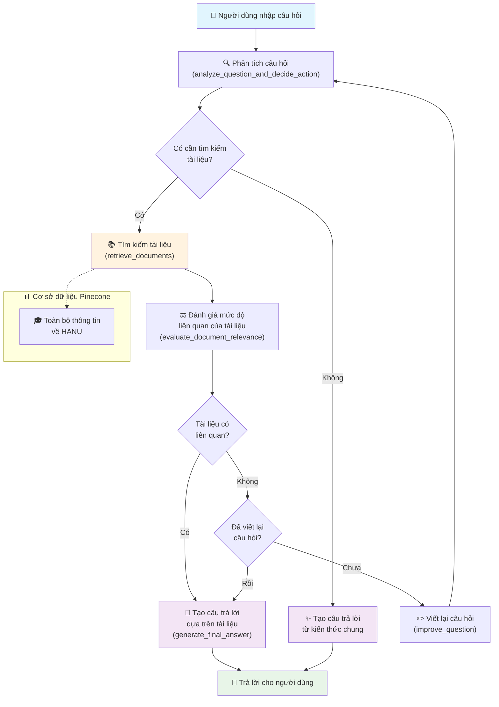

# 🎓 Chatbot Tư Vấn Tuyển Sinh HANU

Ứng dụng chatbot tư vấn tuyển sinh thông minh cho Đại học Hà Nội (HANU) sử dụng RAG (Retrieval-Augmented Generation) và Streamlit, được xây dựng với LangGraph workflow.

## 📖 Tổng Quan

Hệ thống chatbot này sử dụng kiến trúc RAG tiên tiến với LangGraph để cung cấp thông tin tuyển sinh chính xác và cập nhật. Bot có khả năng tự động tìm kiếm, đánh giá và tổng hợp thông tin từ cơ sở dữ liệu tổng hợp về trường HANU.

## 🚀 Tính Năng Nổi Bật

- **🤖 Intelligent RAG Workflow**: Sử dụng LangGraph để xây dựng luồng xử lý thông minh
- **💬 Giao Diện Chat Thân Thiện**: Interface Streamlit hiện đại và responsive
- **🔍 Smart Search**: Tìm kiếm thông minh trên cơ sở dữ liệu tổng hợp
- **📚 Document Management**: Upload và quản lý tài liệu .txt tự động
- **🎯 Smart Question Rewriting**: Tự động cải thiện câu hỏi để tìm kiếm hiệu quả hơn
- **⚡ Real-time Processing**: Xử lý và trả lời câu hỏi theo thời gian thực

## 🔄 Luồng Hoạt Động Chatbot



### Giải Thích Các Bước:

1. **📝 Question Analysis**: LLM phân tích câu hỏi và quyết định có cần tìm kiếm tài liệu hay trả lời trực tiếp
2. **🔍 Document Retrieval**: Sử dụng retrieval tools để tìm kiếm trong database Pinecone
3. **⚖️ Document Evaluation**: Đánh giá mức độ liên quan của tài liệu tìm được với câu hỏi
4. **✏️ Question Rewriting**: Nếu tài liệu không liên quan, tự động viết lại câu hỏi (tối đa 1 lần)
5. **💬 Answer Generation**: Tạo câu trả lời cuối cùng dựa trên tài liệu hoặc kiến thức chung

## 🗃️ Cơ Sở Dữ Liệu

Hệ thống sử dụng 1 Pinecone index tổng hợp:

| Database | Mô Tả | Nội Dung |
|----------|-------|----------|
| 🎓 `retrieve-hanu-info` | Toàn bộ thông tin về HANU | Thông tin giới thiệu, tuyển sinh, lịch sử, học phí, học bổng và các thông tin khác |

## 📋 Yêu Cầu Hệ Thống

- **Python**: 3.8 trở lên
- **API Keys**:
  - OpenAI API Key (cho LLM và embeddings)
  - Pinecone API Key (cho vector storage)

## 🛠️ Hướng Dẫn Cài Đặt

### 1. Clone Repository
```bash
git clone <repository-url>
cd TVTS_HANU
```

### 2. Cài Đặt Dependencies
```bash
pip install -r requirements.txt
```

### 3. Cấu Hình API Keys

Tạo file `.streamlit/secrets.toml` và điền các API key:

```toml
OPENAI_API_KEY = "your_actual_openai_api_key"
PINECONE_API_KEY = "your_actual_pinecone_api_key"
ENTER_KEY = "your_enter_key"
```

### 4. Chạy Ứng Dụng
```bash
streamlit run streamlit_app.py
```

Truy cập: `http://localhost:8501`

## 💻 Hướng Dẫn Sử Dụng

### 🗣️ Chat với Bot

1. **Truy cập ứng dụng** tại `http://localhost:8501`
2. **Nhập câu hỏi** vào ô chat ở cuối trang
3. **Nhận câu trả lời** từ bot với thông tin chính xác từ database

### 📄 Thêm Tài Liệu Mới

1. **Chọn database** phù hợp trong sidebar
2. **Upload file .txt** (định dạng UTF-8)
3. **Nhấn "Thêm Tài Liệu"**
4. **Đợi xử lý** - tài liệu sẽ được tự động chunk và thêm vào vector database

### 💡 Các Loại Câu Hỏi Mẫu

**Tuyển sinh:**
- "Điều kiện tuyển sinh HANU 2025 như thế nào?"
- "Có những ngành nào tuyển sinh năm 2025?"
- "Thủ tục đăng ký xét tuyển ra sao?"

**Tài chính:**
- "Học phí của HANU là bao nhiêu?"
- "Có những loại học bổng nào?"
- "Chi phí sinh hoạt ước tính là bao nhiêu?"

**Thông tin chung:**
- "Trường HANU có những ngành đào tạo nào?"
- "Cơ sở vật chất của trường như thế nào?"
- "Đội ngũ giảng viên có trình độ ra sao?"

**Lịch sử:**
- "Lịch sử hình thành và phát triển của HANU?"
- "Những mốc quan trọng trong lịch sử trường?"

## 🏗️ Kiến Trúc Hệ Thống

```
├── agent/                      # Core RAG Logic
│   ├── graph.py               # LangGraph workflow definition
│   ├── prompts.py             # LLM prompts cho các tác vụ khác nhau
│   └── vectorstore.py         # Pinecone vector store management
├── config/                     # Configuration
│   ├── CONFIG.py              # System configuration
│   └── pinecone_indexes.json  # Database configurations
├── utils/                      # Utilities
│   └── log.py                 # Logging system
├── streamlit_app.py           # Main Streamlit application
├── app.py                     # Alternative entry point
├── requirements.txt           # Python dependencies
└── README.md                  # Documentation
```

### 🧩 Các Thành Phần Chính

**📊 Agent Module:**
- `graph.py`: Định nghĩa LangGraph workflow với các nodes và edges
- `vectorstore.py`: Quản lý kết nối và operations với Pinecone
- `prompts.py`: Template prompts cho evaluation, rewriting, generation

**⚙️ Config Module:**
- `CONFIG.py`: Cấu hình API keys, models, parameters
- `pinecone_indexes.json`: Định nghĩa 4 databases và descriptions

**🖥️ Frontend:**
- `streamlit_app.py`: Giao diện chat và document management

## 🔧 Tùy Chỉnh và Mở Rộng

### Thêm Database Mới

1. **Cập nhật** `config/pinecone_indexes.json` (hiện tại chỉ có 1 database tổng hợp):
```json
{
  "name": "your-new-index-name",
  "description": "Tool description for LLM selection",
  "description_for_human": "Human readable description"
}
```

2. **Restart** ứng dụng để tải cấu hình mới

### Tùy Chỉnh Workflow

Chỉnh sửa `agent/graph.py` để:
- Thêm nodes mới trong workflow
- Thay đổi logic routing
- Cập nhật evaluation criteria

### Tùy Chỉnh Prompts

Chỉnh sửa `agent/prompts.py` để:
- Cải thiện prompt cho evaluation
- Tùy chỉnh style câu trả lời
- Thêm context instructions

## 🐛 Troubleshooting

### Lỗi Thường Gặp

**❌ API Key Error:**
```
ValueError: Required API key not found
```
**🔧 Giải pháp:** Kiểm tra file `.streamlit/secrets.toml` và đảm bảo API keys đúng

**❌ Pinecone Connection Error:**
```
Error initializing Pinecone client
```
**🔧 Giải pháp:** Kiểm tra Pinecone API key và kết nối internet

**❌ File Upload Error:**
```
Error loading document
```
**🔧 Giải pháp:** Đảm bảo file .txt sử dụng encoding UTF-8

### Debug Steps

1. **Kiểm tra logs** trong terminal
2. **Verify API keys** trong secrets.toml
3. **Test kết nối** Pinecone và OpenAI
4. **Kiểm tra file format** (.txt, UTF-8)

## 📊 Performance Notes

- **Response Time**: 2-5 giây tùy thuộc vào độ phức tạp câu hỏi
- **Document Processing**: ~1-2 giây per document chunk
- **Concurrent Users**: Phù hợp cho 10-50 users đồng thời
- **Vector Search**: Sub-second response time

## 🤝 Đóng Góp

Để đóng góp vào dự án:

1. Fork repository
2. Tạo feature branch
3. Commit changes
4. Push và tạo Pull Request

## 📞 Hỗ Trợ

Nếu gặp vấn đề, hãy kiểm tra:

✅ **API Keys**: Đảm bảo keys hợp lệ và có đủ quota  
✅ **Dependencies**: Cài đặt đầy đủ packages từ requirements.txt  
✅ **Network**: Kết nối internet ổn định  
✅ **File Format**: Chỉ upload file .txt với encoding UTF-8  
✅ **Python Version**: Python 3.8+ được khuyên dùng  

---

**Made with ❤️ for HANU Admissions**

*Phiên bản: 1.0.0 | Cập nhật: 2024* 